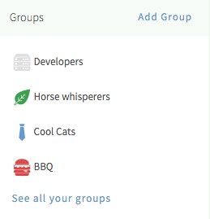
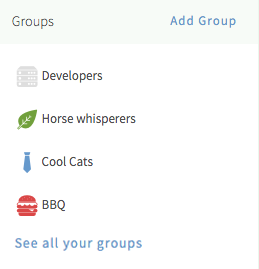
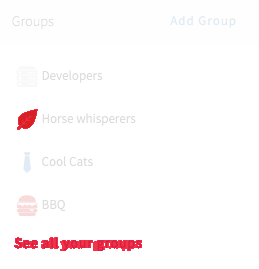

# argus-eyes
[](https://www.npmjs.org/package/argus-eyes)
[](https://travis-ci.org/branneman/argus-eyes)

A lightweight commandline tool for visual regression testing of UI components.

Argus-eyes does 3 things for you:  

1. Take screenshots of UI components in different views and branches
2. Test the screenshots for visual differences
3. Create images of the visual differences

Screenshots are caputured with [PhantomJS](http://phantomjs.org/), comparing sceenshots is done using
[ImageMagick](http://www.imagemagick.org/).

| Production version | Development version | Diff image |
| --- |---| ---|
|  | |  |


## Contents

- [Install](#install)
- [Introduction](#introduction)
- [Guide](#guide)
  - [Step 1: Setup config file](#step-1-setup-config-file)
  - [Step 2: Take screenshots](#step-2-take-screenshots)
  - [Step 3: Test for visual differences](#step-3-test-for-visual-differences)
  - [Gitflow: Testing separate branches](#gitflow-testing-separate-branches)
- [Reference](#reference)
  - [Config](#config)
  - [Usage](#usage)
  - [Options](#options)
- [Contributing](#contributing)
- [License](#license)


## Install

- Install [Node.js](http://nodejs.org/), at least v4
- Install [ImageMagick](http://www.imagemagick.org/)
- Install argus-eyes using npm:

```
$ npm install argus-eyes -g
```

*Note:* For OSX we recommend installing ImageMagick with [Homebrew](http://brew.sh/): `$ brew install imagemagick`


## Introduction

After installing, you want to tell argus-eyes which pages and which components to check for visual regression.
Argus-eyes works by going over a straightforward JSON file containing the resolutions you want to capture, as well as
the pages with their url's, and the components with their CSS-selectors.

Once argus-eyes knows where to find the components, it's time for some command line action. The first command you want
to use is `$ argus-eyes add master`. This makes argus-eyes go over the config file and take screenshots of
all specified components in there. The screenshots are saved in **`.argus-eyes/master`** and this set of screenshots can
be compared with another set.

Say you want to compare the components in your dev branch with those in your master branch. Now is the time to switch
branches and do a new `$ argus-eyes add dev`.

To compare the 2 sets you run `$ argus-eyes compare master dev`, that's it! Argus-eyes now checks all supposedly
identical screenshots for visual differences. If differences were found, a new folder **`.argus-eyes/diff_master_dev`**
is created. This folder contains overlay-images of the offending components, highlighting their differences in red.


## Guide

### Step 1: Setup config file

Before argus-eyes can measure visual differences, it needs a list of pages and components. By
default argus-eyes expects an **`argus-eyes.json`** file in the current working directory.

The config file must be a valid JSON object, containing 3 arrays: **`sizes`**, **`pages`** and
**`components`**. Sizes are simple strings. Page objects require a name, url and list of components. Components require
a name and a CSS-selector. Components can optionally take a list of selectors of elements to ignore, this selector is
appended to the component selector. See the [Config](#config) section for a more detailed format description.

**Example config file:**
```json
{
  "sizes": ["320x480", "1280x768"],
  "pages": [ {
      "name": "homepage",
      "url": "http://localhost:3000/",
      "components": [ "navigation", "news-items" ]
    }, {
      "name": "contact",
      "url": "http://localhost:3000/contact.html",
      "components": [ "navigation" ]
    } ],
  "components": [ {
      "name": "navigation",
      "selector": ".nav"
    }, {
      "name": "news-items",
      "selector": ".news-items",
      "ignore": [ ".last-updated" ]
    } ]
}
```


### Step 2: Take screenshots

After setting up the JSON, argus-eyes can be put to work. Let's create your first set of screenshots of the components
we specified. To do that, you can use the **`argus-eyes add`** command:

```bash
$ argus-eyes add <name>
```

It's best to name your set of screenshots semantically, after your current git branch for example.

Argus-eyes now creates a folder called **`.argus-eyes/<name>/`**, and saves the screenshots of all components specified
in the config file.

Now, you can switch branches and save another set of screenshots.


### Step 3: Test for visual differences

When any 2 sets of screenshots were created, argus-eyes can compare them for visual differences. Comparison is done with
the **`argus-eyes compare`** command:

```bash
$ argus-eyes compare <left> <right>
```

If visual differences between supposedly identical components are found, a new folder is created. This folder contains
images of the offending components, highlighting their differences in red.

_Note:_ Please make sure to add **`'.argus-eyes'`** to your **`.gitignore`**!

### Gitflow: Testing separate branches

Argus-eyes is especially useful for checking visual regression between different branches. Say you're working on a
feature branch and you want to make sure your changes have no unintended side effects:

**On the `feature/navigation` branch:**
```bash
$ argus-eyes add feature/navigation
```

**On the `develop` branch:**
```bash
$ argus-eyes add develop
$ argus-eyes compare develop feature/navigation
```

If any differences are found, the visual diff images are stored in **`.argus-eyes/diff_develop_feature-navigation/`**


## Reference

### Config

Argus-eyes will look in the current working directory for a file named **`argus-eyes.json`**. This file contains your
sizes, pages and components. You can specify a different location file using the **`--config`** argument, as described
in [Options](#options).

The config needs to be valid [JSON](http://www.json.org/), and it needs to obey this format specification:

```js
{
  sizes: [
    String               // Size string, example: "1024x768"
    // ...
  ],
  pages: [
    {
      name: String,      // Identifier, used in filenames
      url: String,       // Valid URL
      components: [
        String           // Component identifier
        // ...
      ]
    }
    // ...
  ],
  components: [
    {
      name: String,      // Identifier, used in page objects and filenames
      selector: String,  // CSS selector, to clip the screenshot
      ignore: [          // Optional array of excluded child elements
        String           // CSS selector, to `display:none` a child element
        // ...
      ]
    }
    // ...
  ]
}
```


### Usage

#### `argus-eyes add <name>`

Run argus-eyes and save all the screenshots under **`.argus-eyes/<name>/`**

#### `argus-eyes compare <name1> <name2>`

Compare the two sets of screenshots, creating overlay-images and reporting any difference. The process will exit with
code 0 when no significant differences were found, code 1 when differences were found.


### Options

Argus-eyes can take several optional arguments on the CLI. Because `add` and `compare` take positional arguments, any
of these options must be placed last.

#### `--config=…`

_Default:_ **`argus-eyes.json`**

Use a different config file.

```bash
$ argus-eyes add feature/navigation --config=config.json
```

#### **`--threshold=…`**

_Default:_ 2

Set the threshold for comparison differences, expects a percentage between 0 and 100. If the difference between 2 files
is bigger than this percentage, it will be treated as different and reported as such.

When comparing screenshots, argus-eyes checks if all pixels in screenshots are identical. The difference is calculated
by dividing the number of different pixels by the total number of pixels, giving a percentage. The image is considered
different when this percentage exceeds the threshold percentage.

**Be advised**: You can [exclude html elements](#config) from being captured! You might want to look into that before
increasing the threshold, since that will also increase the chance of unintended changes getting through.

```bash
$ argus-eyes compare develop feature/navigation --threshold=10
```

#### **`--base=…`**

_Default:_ **`.argus-eyes`**

Use a different base directory for storing the screenshots and comparison results.

```bash
$ argus-eyes add develop --base==visual-regression
```

#### **`--im=…`**

Set the path where the ImageMagick `compare`, `convert` and `identify` executables can be found. This path needs to end
with a slash (or backslash on Windows). It is empty by default, expecting the executables in your `PATH` variable.

```bash
$ argus-eyes add develop --im="/usr/local/Cellar/imagemagick/6.9.2-5/bin/"
$ argus-eyes add develop --im="C:\Program Files\ImageMagick\"
```

#### **`--verbose`**

Turn on verbose output.

```bash
$ argus-eyes compare develop feature/navigation --verbose
```

#### **`--no-color`**

Turn off colored output. Output is colored by default.

```bash
$ argus-eyes add develop --no-color
```

#### **`--help`**

Print usage information.

```bash
$ argus-eyes --help
```

#### **`--version`**

Print version.

```bash
$ argus-eyes --version
```


## Contributing

Want to contribute to argus-eyes? Awesome! You can contribute in multiple ways. Found a bug? Thought of a new feature?
Check the [contributing guidelines](CONTRIBUTING.md) and find out how to contribute.


## License

Released under the [Creative Commons — Attribution 4.0 International license](https://creativecommons.org/licenses/by/4.0/).
